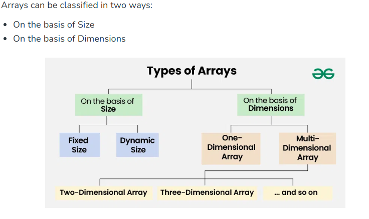

Array is a linear data structure that stores elements of the same data type at contiguous memory locations; sequentially in memory
0-based index

**Is the array always of a fixed size?**
Arrays at core are of fixed size only, but most of the languages provide dynamic sized arrays using the underlying fixed sized arrays. 
For example, vector in C++, ArrayList in Java and list in Python. In C language, the array has a fixed size meaning once the size is given to it, it cannot be changed i.e. you can’t shrink it nor can you expand it.

Terminologies; Index, Element, Length

Note:
Arrays are used to implement other data structures like stack, queue, dequeue and heap
The main advantages are cache friendliness and random access memory

**Array Declaration**
`data_type array_name[];`

**Initialization of an Array**
`data_type array_name[] = {elements};`

**Types of Arrays**

Fixed size and dynamic size like ArrayList in Java

**Operations on Arrays**
1. **Array Traversal**

**Types of Array Traversal**
- Array traversal can be done in multiple ways based on the requirement:

1. **Sequential (Linear) Traversal**
This is the most common way of traversing an array.
It involves iterating through the array one element at a time from the first index to the last.
Used for printing elements, searching, or performing calculations (such as sum or average).

2. **Reverse Traversal**
Instead of starting from index 0, the traversal begins from the last element and moves towards the first.
This is useful in cases where we need to process elements from the end.

2. Insertion in Array
- adding a new element. Since arrays have a fixed size in static implementation, insertion often requires shifting elements to make space.

* Identify the position where the new element should be inserted
* Shift elements one position forward to create space for the new element
* Insert the new element
* Update the size (if applicable); for dynamic arrays, it's size is increased.

**Types of Insertion**

1. Insertion at the Beginning (Index 0)
Every element must shift one position right.
This is the least efficient case for large arrays as it affects all elements.

2. Insertion at a Specific Index
Elements after the index shift right.
If the index is in the middle, half of the array moves.

3. Insertion at the End
The simplest case since no shifting is required.
Used in dynamic arrays where size increases automatically (e.g., Python lists, Java ArrayList).

3. Deletion in an Array
- removing an element from an array requires shifting elements to fill the gap.

* Identify the position
* Shift elements after the deleted element one position to the left
* Update the size if (applicable): If using a dynamic array, the size might be reduced.

**Types of Deletion**

1. Deletion at the Beginning (Index 0)
Every element shifts left by one position.
This is the most expensive case as it affects all elements.

2. Deletion at a Specific Index
Only elements after the index shift left.
If the index is in the middle, half of the array moves.

3. Deletion at the End
The simplest case since no shifting is required.
The size of the array is reduced (in dynamic arrays).

4. Searching in Array
The goal is to determine whether the element exists in the array and, if so, find its index (position).
Searching is a fundamental operation in programming, as it is used in data retrieval, filtering, and processing.

**Types of Searching in Array**
1. **Linear Search**
Simplest search algorithm
Traverses one array element at a time and compares each element with the target value.
If a match is found, it returns the index of the element.
If the element is not found the search continues til the end of the array.

2. **Binary Search**
Efficient for sorted arrays, works only on sorted arrays.
Divide and conquer approach; repeatedly divides the search space in half until the target element is found.

1. Find the middle element of the array.
2. If the target is equal to the middle element, return its index.
3. If the target is less than the middle element, search the left half.
4. If the target is greater than the middle element, search the right half.
5. Repeat until the element is found or the search space is empty.

**Applications of Arrays**
Main Advantages; cache friendliness and random access

* Storing and accessing data: Allow constant time O(1) access to elements
* Searching: for sorted arrays, we can search an item in O(log n) time. We can also find floor(), ceiling, kth smallest, kth largest etc.
* Matrices: two-dimensional arrays are used for matrices in computations like graph algorithms, image processing.
* Implementing other data structures like stacks, queues
* Dynamic programming: Dynamic programming algorithms often use arrays to store intermediate results of subproblems in order to solve a larger problem.
* Data Buffers: Arrays serve as data buffers and queues, temporarily storing incoming data like network packets, file streams, and database results before processing.

**Advantages of Arrays**
Efficient and fast access to any element in the collection with constant access time.
Memory efficiency due to contiguous memory allocation.
Versatility; arrays can store a wide range of data types
Compatible with most hardware architectures

**Disadvantages of Arrays**
* Have fixed size
* Allocating large arrays can lead to memory exhaustion
* Insertion and deletion is inefficient due to shifting of elements
* Supports only elements of the same type, limiting their use with complex data types
* Less flexible and/or adaptable due to fixed size and limited data type support.

**Cache Friendliness in Arrays**
When data is stored contiguously in memory (like in arrays), the CPU can load entire blocks of memory cache at once.

**Multidimensional Arrays**
- arrays of arrays

**Time Complexities**
* Access: O(1)
* Search: O(n) for unsorted, O(log n) for sorted (binary search)
* Insertion: O(n) (worst case due to shifting)
* Deletion: O(n) (worst case due to shifting)

**Dynamic Arrays (ArrayList in Java)**
* Automatically resizes when full (typically doubles capacity)
* Amortized O(1) for insertion at end
* Still maintains O(1) random access