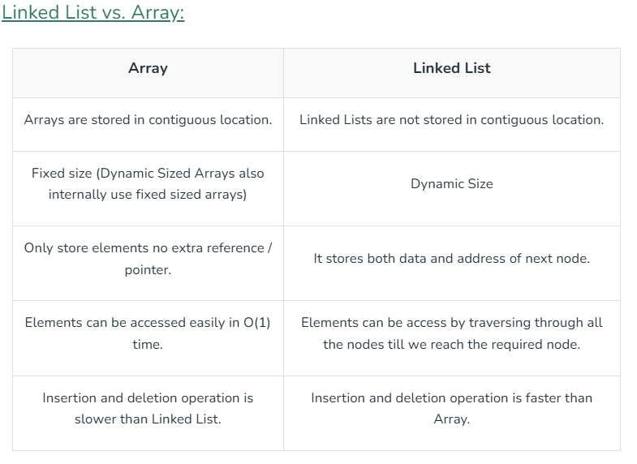
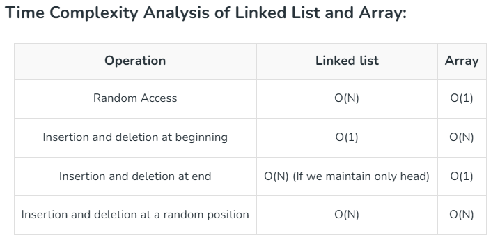

Linked List is a non-linear dat structure that forms a seriies of connected node, where each node stores the data and the address of the next node.

**Terminologies**
* Node: Linked List consists of a series of nodes where each node has two parts: data and next pointer.
* Data: Data is the part of node which stores the information in the linked list.
* Next pointer: Next pointer is the part of the node which points to the next node of the linked list.
* Head; points to the first node of the list, when the list is empty it points to null
* Tail; The last node point to NULL or nullptr- tail node

Mainly preferred over array due to ease of insertion and deletion.

Like arrays, used to implement other data structures like stack, queue, dequeue

### Linked List Operations
**Insertion** - adjusting the pointers of the existing nodes to maintain the proper sequence.
**Deletion** - requires adjusting the pointers of the neighboring nodes to bridge the gap left by the deleted node.
**Searching** - traverse the list from the head node until the value is found or the end of the list is reached.

**Types of LinkedList**
* Single Linked List - forward navigation only
* Double LInked List - forward and backward navigation
* Circular Linked List - last item contains link to the first element as next and the first element contains link to the last element as previous.
Both Singly Linked List and Doubly Linked List can be made into a circular linked list.

### Singly Linked List

**Basic Operations**

* **Insertion**: at the beginning, end or specific location
* **Deletion**: at the beginning, end or specific location
* **Traverse**: displays the elements
* **Search**

### Doubly Linked List
1. **Insertion**
* At the beginning
* After a given node
* At the end
* Before a given node
2. **Deletion**
* From the beginning
* From the end of the list
* A specific node
3. **Display**

### Circular Linked List
**Insertion**
* In an empty list
* At the beginning of a list
* At the end of the list
* In between the nodes

**Deletion**
* From the beginning of the list
* From the end of the list
* A specific node
**Display** displays

**Advantages**
* Dynamic - size of memory can be allocated or de-allocated according to need.
* Ease of Insertion or Deletion - no elements need to be shifted, just the address needs to be updated
- Insertion and deletion takes O(1) time while arrays take O(n) time
* Efficient memory utilization - dynamic hence avoids wastage of memory
* Used to implement other D.S like stack, queues, hashmaps, graph

**Applications of LinkedList**
1. Used to implement stacks, queue, deque, sparse matrices.
2. Dynamic Memory Allocations in Operating systems and compilers.
3. Manipulation of polynomials.
4. Arithmetic operations on long integers.
5. In OS they can be used in Memory management, process scheduling(circular linked list)and file system
6. Algorithms that need to frequently insert or delete items from large collections of data.
7. LRU cache, which uses a doubly linked list to keep track of the most recently used items in a cache.

**Applications of Linked Lists in real world:**
1. The list of songs in the music player are linked to the previous and next songs.
2. In a web browser, previous and next web page URLs can be linked through the previous and next buttons (Doubly Linked List)
3. In image viewer, the previous and next images can be linked with the help of the previous and next buttons (Doubly Linked List)
4. Circular Linked Lists can be used to implement things in round manner where we go to every element one by one.
5. Linked List are preferred over arrays for implementations of Queue and Deque data structures because of fast deletions (or insertions) from the front of the linked lists.

**Disadvantages of Linked Lists**
* **Slow Access time**- you need to traverse the linked list to find the element you're looking for; O(n) operation
* **Pointers or References** make it complex than arrays which could be difficult to debug and maintain the code
* **High overhead** than arrays because every node requires extra memory space to store the pointer
* **Cache inefficiency** because memory is not contiguous

