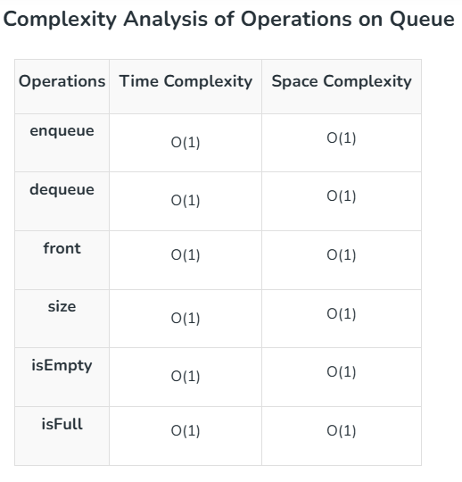
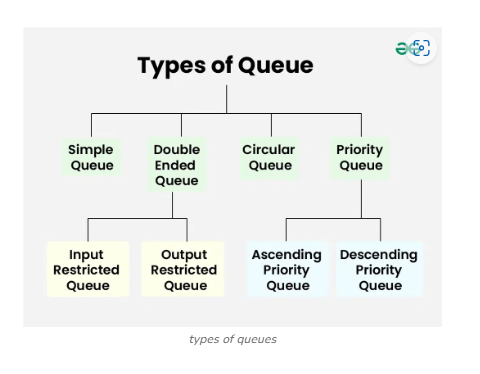

It's a linear data structure that follows the **FIFO** (First In First Out) principle.
The first element to be added will be the first to be removed or processed.

**Basic Terminologies**
* **Front/Head**: the first entry.
* **Rear/Back/Tail**: the last entry.
* **Size**: current number of elements in the queue.
* **Capacity**: maximum number of elements the queue can hold.

**Queue Operations**
1. **Enqueue**: adding an element at the end of the queue. If the queue us full, an overflow error occurs
2. **Dequeue**: removing an element from the queue. If the queue is empty and underflow error occurs.
3. **Peek/Front**: returns the element at the front without removing it.
4. **Size**: returns the number of elements in the queue.
5. **isEmpty**: returns true if the queue is empty, otherwise false.
6. **isFull**: returns true if the queue is full, otherwise false.

**Types of Queues**
1. **Simple Queue**: follows FIFO structure, implemented using either a linked list or a circular array.
2. **Double-Ended Queue (Deque)**: Insertion and deletion can be done from any of the both ends. 2 types:
* **Input-restricted End**: Input can be taken from only one end but deletion can be done from any of thr ends.
* **Output-Restricted End**: Output can be done one end but input can be taken from both ends.
3. **Priority Queue**: A queue where the elements are accessed based on the priority assigned to them.
* **Ascending Priority Queue**: elements are arranged in increasing order of their priority values.
Elements with smallest priority values are popped first.
* **Descending Priority Queue**: elements are arranged in decreasing order of their priority values
Element with largest priority eis popped first.

**Applications of Queue Data Structure**
