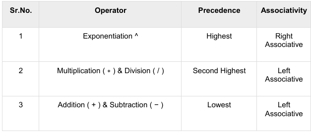

Algorithms
A set of step by step instructions that are required to solve a given problem or achieve a desired goal.

**Categories**
1. Search
2. Sort
3. Update
4. Insert 
5. Delete
6. Traverse

**Characteristics of an Algorithm**
* Unambiguous - clear and concise
* Input - 0 or more
* Output - 1 or more 
* Feasible - with the available resources
* Independent - of the P.L
* Finite - complete after a finite number of steps

Algorithms are written in Pseudocode and Flowcharts

**Algorithm Analysis**
- Evaluating the performance of algorithms and programs. 
Efficiency is measured in terms of time and space.
- determination of the amount of time and space resources required to execute it.

In 2 stages:
1. **Priori Analysis**
Theoretical Analysis. 
Determined while assuming other factors e.g. processor speed are constant and have no effect on implementation.

2. **Posterior Analysis.**
Empirical Analysis
The algorithm is implemented using a P.L and then executed on a target machine, actual stats are collected; time and space

**Asymptotic Analysis**
Computing the running time of any operation in mathematical units of computation. 
It is input bound i.e if there's no input to the algorithm, it's concluded to work in a constant time.

**Does it Always Work?**

https://www.geeksforgeeks.org/asymptotic-notation-and-analysis-based-on-input-size-of-algorithms/

1. **Worst Case**
- Most commonly used analysis of algorithms
- Calculate the upper bound on the running time of an algorithm - the case that causes the max number of operations to be executed.

2. **Best Case**
- Rarely used
- Calculate the lower bound on the running time of an algorithm.
-the case that causes a min number of operations.

3. **Average Case**
- Rarely used

Types of Asymptotic Annotations
* Theta notation- reps the upper and lower bound of an algorithm- used for average case complexity of an algorithm.
* Big-O Notation - rep the upper bound, provides the worst case.
* Omega Notation - rep the lower bound of an algorithm, provides the best case

### Big-O Notation
- It is a way to express the upper bound of an algorithm's time or space complexity.

**Importance of Big O-Notation**
* Big O Notation is important because it helps analyze the efficiency of algorithms. 
* It provides a way to describe how the runtime or space requirements of an algorithm grow as the input size increases.
* Helps in understanding the scalability of algorithms and predicting how they will perform as the input size grows.
* Enables developers to optimize code and improve overall performance.

**Finding the Big-O of an expression**
* Ignore the lower order terms and consider only highest order term.
* Ignore the constant associated with the highest order term.

**Common Big-O Notations**
1. Linear Time Complexity: Big O(n)
2. Logarithmic Time Complexity: Big O(log n)
3. Quadratic Time Complexity: Big O(n^2) 
4. Cubic Time Complexity: Big O(n^3)
5. Polynomial Time Complexity: Big O(n^k)
6. Exponential Time Complexity: Big O(2^n)
7. Factorial Time Complexity: Big O(n!)

#### Time Complexity

#### Space Complexity
Space Complexity != Auxiliary Space

- Auxiliary Space is the extra space or temporary space used by an algorithm.
- **Space Complexity** of an algorithm is the total space taken by the algorithm with respect to the input size.
It includes both auxiliary space and space used by input

To estimate the memory requirement we need to focus on two parts:

1. **A fixed part:** 
It is independent of the input size. 
It includes memory for instructions (code), constants, variables, etc.

2. **A variable part:** 
It is dependent on the input size. 
It includes memory for recursion stack, referenced variables, etc.

**Logic Building**

- Creating clear, step-by-step methods to solve problems using simple rules and principles

**Tips**
Understand the Problem statement.
Generate examples: Create additional input and output cases for each problem.
Draw observations and patterns based on the examples you created
Start with basic ways to solve the problem and apply further conditions.

Try these problems for a start: https://www.geeksforgeeks.org/logic-building-problems/

**Expression Parsing**
**Notation** can be defined as a way of writing mathematical expression.
3 types based on how the operator is used;
* Infix notation
* Prefix (Polish) notation
* Postfix (Reverse-Polish) notation

**Infix notation** 
Operators are used in between operands ie a + b
not suitable for computers; could be difficult and costly in terms of time and space consumption.

**Prefix notation also Polish notation**
Operator is written ahed of operands +ab

**Postfix notation also Reversed Polish Notation**
ab+

**Parsing Expression**
for efficiency infix notations are converted to prefix or postfix and then computed. 
To parse an arithmetic expression we look into operator precedence and associativity.

**Precedence**
Which operator goes first.

**Associativity**
Associativity describes the rule where operators with the same precedence appear in an
expression. 

**Searching Algorithms**
2 most common algorithms
1. Linear Search
2. Binary Search

##### Youtube Takeaways
**Abstract Data Types**
1. **Arrays**
Values, index, memory address

**Operations**
Read - easy 
Search
Insertion

Sorted Arrays

**Time Complexity**
Algorithm - a set of instructions 
Algorithm analysis

